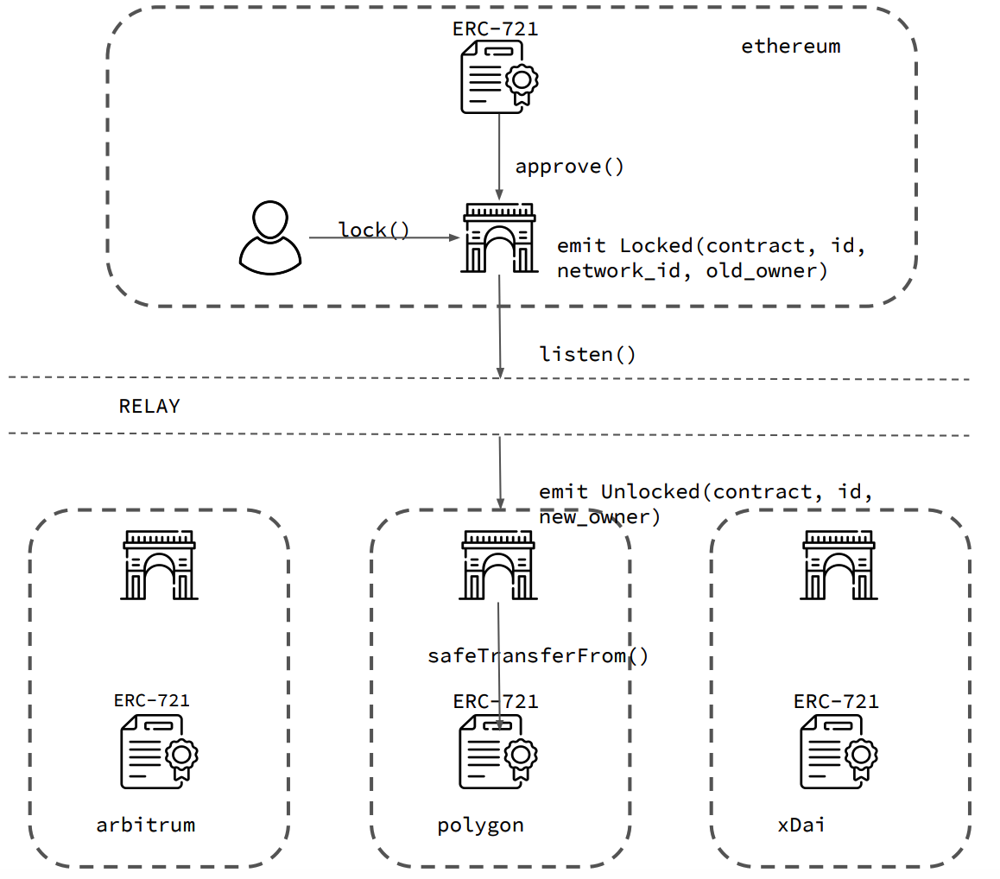

# NFT interperobility
## Abstract
Pretty naive albeit pretty robust model to make NFTs operable in different blockchains is to implement variation of a master-slaves model. This model is classic for  the distributed system theory and is applied often. Idea is rather straightforward: to apply changes to distributed (sharded) state we choose master partition (leader) which process all updates (owner change of a NFT) and eventually replicate these changes to slave (replica) partitions. 
For example, consider following scenario: we mint a NFT on Ethereum network and move it for processing to polygon network, which is logical. To implement such a mechanism we need two important components: the gateway contract and relay. 

## NFT Contract
In order not to break working things we won't touch existing ERC-721 token contracts. When we want to add a new network it is necessary to create the same ERC-721 contract in a new network and mint all NFTs to the Gateway contract, it means that this token is locked in the new network and can be unlocked only via relay.

## Gateway contract
It is a pretty simple component to implement. Gateway is an IERC721Receiver smart contract that receives a NFTs and owns them till they are returned to the original network. 
It has two methods: `lock(contract, id, token_id)` and `unlock(contract, id, new_owner)`, emits two events `Locked(contract, id, network_id, old_owner)` `TokenUnlocked(contract, id, new_owner)`. 

## Relay
It is the most challenging part, there are several ways to implement this component, each has its pros and cons.

### Centralized relay
The simplest solution and pretty robust. It listens for `TokenLocked` and `TokenUnlocked` events in all networks. When token is locked in network A for network B, it executes `safeTransferFrom()` in network B to certain user, previous owner is Gateway contract in network B. When this token is transferred from network B to network C the same actions are implemented for it, the token is locked in B for C and `safeTransferFrom()` is called in C.

**Pros:** 
* easy to implement

**Cons:** 
* this variant is fully centralized and is a big security tradeoff.

### Plasma-like relay
This solution is similar to the first one but challenging mechanics (similar to one used in plasma) is added. `safeTransferFrom()` will be delayed for standard  challenging period in these cases. The common way to prove that a token has not been transferred to Gateway contract in network A and call to `safeTransferFrom()` was an adversarial act is to implement light client in network B. It means that it is necessary to have all headers of other blockchains in network A (and vice versa since we have simmetric setup). It does not seem to be implementable in practice (unless this service is common for network like Chainlink price feed but for blockchain metadata) since networks generate decent amount of metadata and such data transfer to Ethereum network will be pretty costly. I think it can look  simmilar to what guys from Near protocol implemented in their rainbow bridge.

**Pros:** 
* no security tradeoff 
* pretty simple to implement

**Cons:** 
* needs common chain data service
* should incentivize challenging adversarial actions

### Independent security relay
It is possible to have special network with its own security model, e.g. polkadot parachain or independent network like Gagarin. This network will operate similar to centralized relay but there will be consensus on event data, e.g. in Hotstuff we can use 3-chain commit rule for such a finalization and BLS aggregated signature for proof of achieved consensus. 

**Pros:**
* pretty secure and decentralized

**Cons:**
* in theory we won't achieve the level of worst secured network we want to work with.

### ZK-proof relay
The most challenging, but the most promising is to create advance cryptografical proofs (zk-snarks) of state change. Which can replace 3-chain commit or lite client proof in examples above.

**Pros:** 
* pretty elegant method without security tradeoff

**Cons:**
* advanced cryptography is hard to implement 

